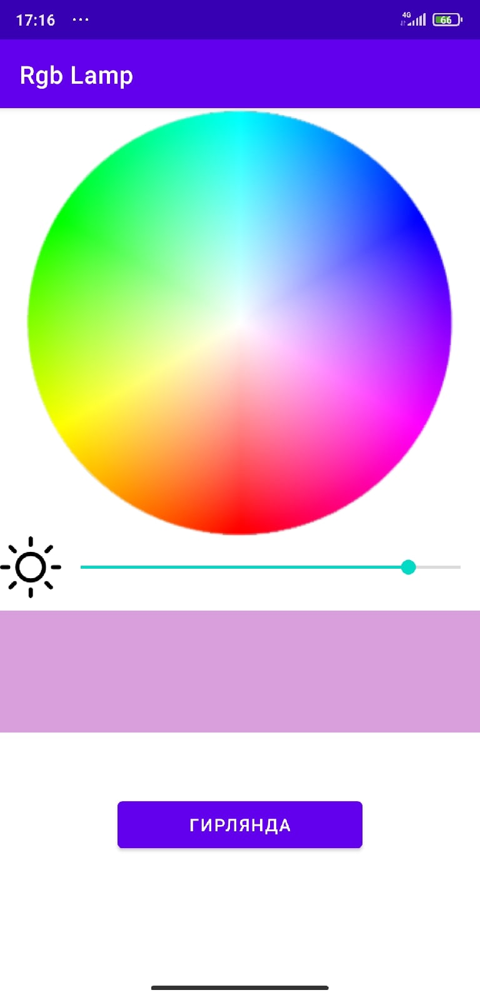

# Kotlin RGB Lamp Controller

This application is designed to control an RGB lamp via bluetooth.

Introduction
------------

This application is based on several tutorials from web and the java app I developed several years ago for my RGB lamp.
It provides convenient functionality for picking colors and sending their codes to the lamp via bluetooth.

Screenshots
-------------

Pre-requisites
--------------

- Android SDK v27
- Android Build Tools v27.0.3
- Android Support Repository

Getting started
---------------

This app uses the Gradle build system. To build this project, use the "gradle build" command or use "Import Project" in Android Studio.
